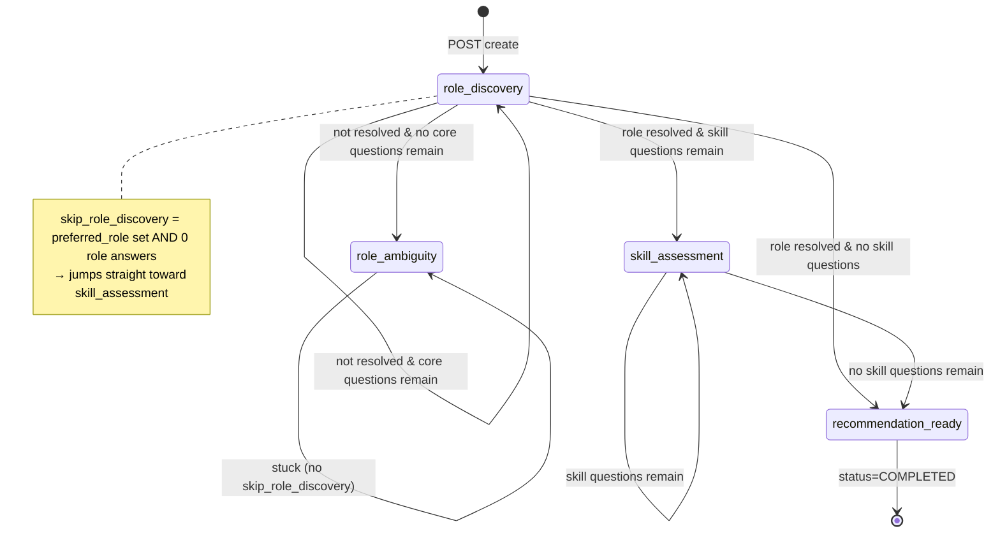
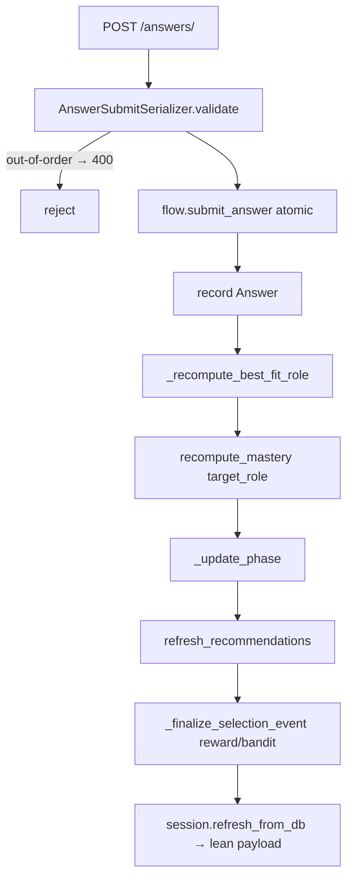
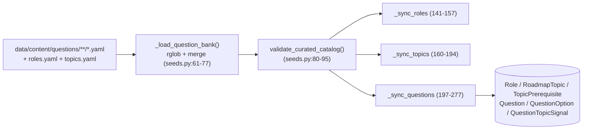
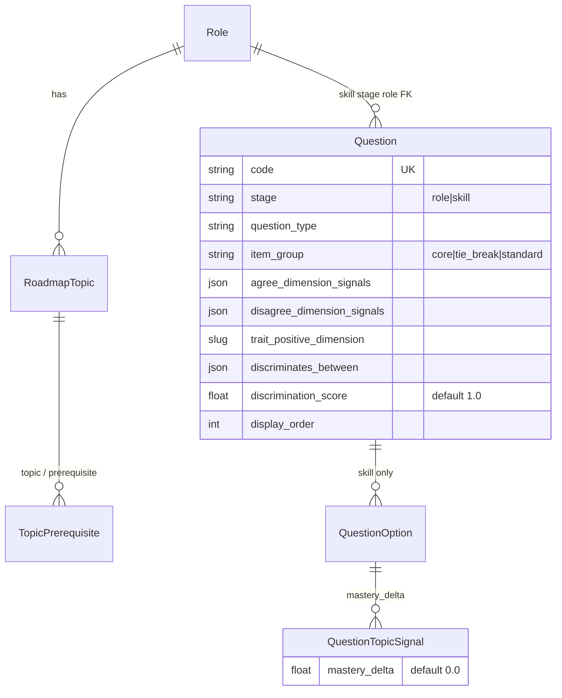
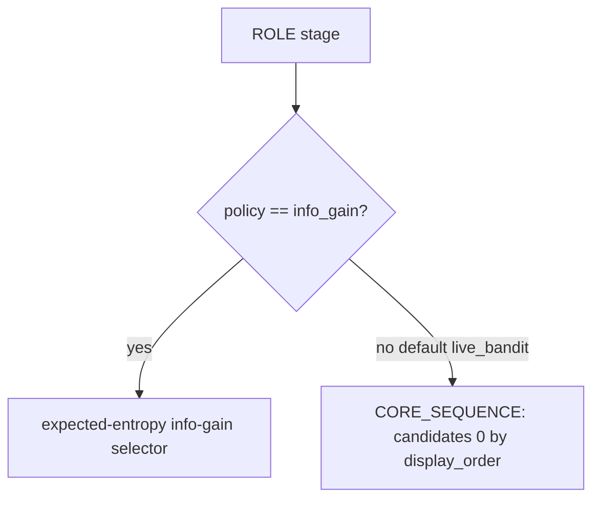

<!--
Generated 2026-06-21 via a multi-agent codebase deep-research pass (8 subsystem maps,
each adversarially verified against the source, then synthesized). Core scoring/selection
math independently re-verified by reading role_inference.py, selection.py, flow.py,
mastery.py, questionnaire.py, seeds.py and the runtime settings. All file:line citations
are as of the current `main` checkout — re-anchor them if the code moves.
-->

# CompetencyX Role Assessment + Recommendation + Scoring Engine — Technical Reference

> **Audience:** New engineers on the CompetencyX backend.
> **Scope:** Role Discovery (role discovery), Skill Assessment (PSP/SDLC competency), the recommendation builder, the question catalog, and the offline tuning/benchmarking harness.
> **Authority note:** This document applies every correction from the verified reproducibility maps. Where the original maps and their `verify` blocks disagreed, the corrected version is used. All file:line citations below are the *corrected* ones.

---

# PART A — How It Works Today (Reproducible Spec)

## A.0 The two surveys at a glance

| | Role Discovery (Role Discovery) | Skill Assessment (PSP/SDLC Competency) |
|---|---|---|
| Goal | Identify best-fit software-engineering role | Self-assess PSP/SDLC practice maturity |
| Items | 36 core + 12 tie-break Likert-5 role questions; then SKILL questions per topic | 11 fixed Likert 1–5 questions over 8 dimensions |
| Storage | `roadmaps.Question`/`QuestionOption`/`QuestionTopicSignal` | `assessments.SkillAssessmentQuestion`/`SkillAssessmentDimension`/`SkillAssessmentRoleGuidance` |
| Selection | Entropy info-gain **or** core-sequence (ROLE); UCB1 bandit (SKILL) | Epsilon-greedy tabular Q-values |
| Scoring output | Per-role evidence → softmax distribution → best-fit role | **No per-dimension score is computed**; raw answers feed a Q-table + one aggregate reward |
| Mastery | `recompute_mastery` over SKILL answers → `TopicMastery` | None (Skill Assessment has no mastery scoring) |

A critical, frequently-misunderstood fact: **Skill Assessment does not compute a competency/mastery score per dimension.** The only mastery score in the codebase is the Role Discovery SKILL-stage `TopicMastery` (`assessments/mastery.py`). See §A.6.

---

## A.1 End-to-end session/phase flow (the state machine)

A session is a UUID-keyed `AssessmentSession` (`assessments/models.py:31-96`) mounted at `/api/assessment-sessions/`. Every answer POST runs an atomic pipeline in `flow.submit_answer` (`assessments/flow.py:99-166`):

1. Re-check expected question (mismatch → `AssessmentFlowError` → HTTP 400).
2. Resolve/create the pending `QuestionSelectionEvent`.
3. Create the `Answer` via `get_or_create` (duplicate → "already been answered").
4. `_recompute_best_fit_role` (`flow.py:216-253`).
5. `recompute_mastery(target_role=get_skill_target_role(session))` (`flow.py:162`).
6. `_update_phase` (`flow.py:256-328`).
7. `recommendation_builder.refresh_recommendations` (`flow.py:161-164`).
8. `_finalize_selection_event` (selection.py reward + bandit update).

### Phase enum
`role_discovery | role_ambiguity | skill_assessment | recommendation_ready | completed` (`assessments/models.py:40-45`). `_update_phase` only ever sets `RECOMMENDATION_READY` (with `status=COMPLETED`, `completed_at=now`) on finish; `Phase.COMPLETED` is defined but unused.

### State machine (`_update_phase`, flow.py:256-328)



### Per-request data flow



### Masking rule
`best_fit_role` / `best_fit_confidence` are **persisted on every answer** (`flow.py:216-237`) but the serializer/`build_session_state` mask them to `None`/`0.0` unless `_is_role_inference_resolved(session)` is true (`flow.py:181-200`). Direct DB/admin readers see provisional best-fit data the API hides.

### Endpoints & gates
- `GET /{uuid}/` → lean payload (`build_session_state`).
- `GET /{uuid}/insights/` → any time (`views.py:424-427`); `ranked_roles` empty until 36 core answered.
- `GET /{uuid}/results/` → **409** unless `status==COMPLETED` (`views.py:452-457`).
- `GET /{uuid}/history/` → **409** unless completed (`views.py:496-501`).
- `answers` POST handler: `views.py:543-563`.

> ⚠️ **GET has DB side effects.** `build_session_state → get_current_question → _ensure_selection_event` can INSERT a `QuestionSelectionEvent` on a plain GET (`flow.py:70-96`, `selection.py:376-404`). See Part B.

> ⚠️ **IDOR by design.** `DEFAULT_PERMISSION_CLASSES = ['rest_framework.permissions.AllowAny']` (`config/settings/base.py:105-107`); no view sets `permission_classes`. Any client with a UUID can read/write any session.

---

## A.2 Where questions come from (YAML → DB)

Questions are authored as **YAML fragments** under `data/content/questions/{role,skill}/*.yaml`. The loader `roadmaps/seeds.py` recursively globs every `*.yaml` (`rglob`, sorted lexicographically — `seeds.py:61-77`), merges all `role_questions` and `skill_questions` lists, validates them **in memory** (no DB writes), then upserts via `update_or_create`.

- **Role questions:** role-discovery items live in `role/role-discovery.yaml` (1–917 lines: 36 core + 12 tie-break).
- **Skill questions:** sharded across **26 files** `skill/<role>.yaml` (one per role, **2 questions each ⇒ ~52 skill questions**). All merged by `rglob`.

### Loader pipeline (roadmaps/seeds.py)



Management commands: `sync_content` (atomic load+write); `validate_question_catalog` (validate-only).

### Validation rules (single role question, `_validate_role_question_seed`, seeds.py:330-371)
1. `code` globally unique across all questions.
2. `translations` validated against languages `{en,th}` and fields `{prompt,help_text}` (`seeds.py:24-25`).
3. `item_group` (default `core`) ∈ `{core, tie_break}`.
4. `question_type` **must equal** `likert_5`.
5. Must **not** define `options` (truthiness check: `options: []` slips through — empty list is falsy).
6. `agree_dimension_signals` **and** `disagree_dimension_signals` each: non-empty dict; every key ∈ `ROLE_DIMENSIONS` (the 38-key allowlist — **unknown keys are rejected**); every value `int|float` and `> 0`. *(Applies to **both** core and tie_break — only the KA-intersection check is gated on `core`.)*
7. If `core`: `(agree∪disagree) ∩ CORE_ROLE_DIMENSIONS ≠ ∅`.
8. tie_break: `discriminates_between` ≥ 2 known role slugs (`MIN_TIE_BREAK_ROLE_COUNT=2`, `seeds.py:23`).

### Validation gaps (real)
- **Skill `question_type` is never validated** (`_validate_skill_question_seed`, seeds.py:387-413). A skill question with any `question_type` is stored verbatim (`seeds.py:235`).
- **Prerequisite slugs are never validated.** `validate_curated_catalog` never checks `topic_seed['prerequisites']`. A typo'd prereq slug passes validation, then `KeyError`s in `_sync_topics` at `seeds.py:188` — **after** `TopicPrerequisite.objects.all().delete()` at `seeds.py:182` has already wiped every prerequisite, with **no `@transaction.atomic` wrapper**. This is the real partial-wipe hole.

### `trait_positive_dimension` derivation
```text
trait_positive_dimension = question_seed.get('trait_positive_dimension') or next(iter(agree_dimension_signals), '')
```
`seeds.py:202`. Safe (`''` default, never raises). **`trait_positive_dimension` appears 0 times in role-discovery.yaml**, and all 48 questions define both signal maps — so the iter-fallback is set to the first agree key for every question, and the scoring-time `{trait:1.0}` fallback is **fully dead in practice**.

### Likert response scale is synthesized at read time
Role questions store **no options**. `QuestionSerializer.get_response_scale` returns `get_likert_response_scale(language)` only for `likert_5`, mapping the constant `LIKERT_5_RESPONSE_SCALE`:

| key | value | display_order |
|---|---|---|
| strongly_agree | **+2** | 1 |
| agree | **+1** | 2 |
| neutral | **0** | 3 |
| disagree | **−1** | 4 |
| strongly_disagree | **−2** | 5 |

`roadmaps/serializers.py:10-16, 115-118`.

### Annotated example role-discovery question
```yaml
# data/content/questions/role/role-discovery.yaml
- code: role-swebok-01-requirements   # globally unique slug
  item_group: core                    # core | tie_break (default core)
  question_type: likert_5             # MUST be likert_5 for role questions
  prompt: "I enjoy clarifying ambiguous requirements with stakeholders."
  translations:                       # optional; langs ⊆ {en,th}, fields ⊆ {prompt,help_text}
    th: { prompt: "..." }
  agree_dimension_signals:            # dict dim→positive weight; NON-EMPTY required
    requirements: 1                   # ← first key ⇒ becomes trait_positive_dimension
    people_product: 0.8
  disagree_dimension_signals:         # ALSO required non-empty (even for tie_break)
    architecture: 0.4
  difficulty: 1
  discrimination_score: 4.0           # 4.0 for all 36 core, 4.5 for all 12 tie-break
  display_order: 1                    # cores 1..36, tie-breaks 101..112
  # NO options. help_text & trait_positive_dimension are never authored.
```
Weights are **not normalized or bounded above** — a typo like `10` instead of `1.0` passes validation (`seeds.py:367-370`).

### Data model (DB)


Model lines: `Question` `roadmaps/models.py:87-144`; `QuestionOption` `:147-163`; `QuestionTopicSignal` `:166-184`; `TopicPrerequisite` `:65-84`.

---

## A.3 Pillars / dimensions: canonical list and question→pillar mapping

**The dimension catalog and all role weights live in Python (`roadmaps/questionnaire.py`), NOT in `roles.yaml`.** `roles.yaml` only carries descriptive `top_ka_codes`/`core_tasks` (`data/content/roles.yaml:1-365`).

`ROLE_DIMENSIONS` (38 keys total) = 18 + 8 + 12 (`questionnaire.py:56-57`):

| Tier | Count | Keys |
|---|---|---|
| **SWEBOK KAs** (the "pillars"; `CORE_ROLE_DIMENSIONS`) | 18 | requirements, architecture, design, construction, testing, operations, maintenance, configuration_management, management, process, models_methods, quality, security, professional_practice, economics, computing_ai, math, engineering |
| **Role-family** | 8 | people_product, application_build, backend_platform, data_ai, operations_security, leadership_process, documentation_practice, game_family |
| **Specialization** | 12 | web_frontend, server_backend, android_platform, ios_platform, database_postgresql, blockchain_platform, game_client, game_server, developer_community, technical_documentation, business_intelligence, ml_platform |

### Role profiles
Each of **26 roles** has `ROLE_PROFILE_WEIGHTS[role]` (SWEBOK + one specialization weight) **mutated in place at import** by merging `ROLE_FAMILY_PROFILE_WEIGHTS` (`questionnaire.py:206-207`). So the literal dict in source is *not* the effective profile.

### Question → pillar link
```
question.agree/disagree_dimension_signals (keyed by dimension)
   → IDF-weighted overlap with ROLE_PROFILE_WEIGHTS[role] (same keys)
   → per-role evidence delta
```
`_score_dimension_overlap` (`assessments/role_inference.py:146-156`).

---

## A.4 Scoring: Likert answer → evidence → role probabilities → best-fit

All constants are confirmed at `assessments/role_inference.py:11-26`.

### Step 1 — IDF table (once at import)
For each dimension, `df` = #roles (of 26) with positive weight:
```
idf(d) = ln((N+1)/(df+1)) + 1 ,  N = 26 ,  default 1.0 if d unseen
```
`role_inference.py:165-178`. Verified examples: `quality` df=26 → idf=1.0; `engineering` df=5 → idf≈2.504 (**mid-tier, not "outsized"**); df=1 specializations → idf≈3.603; `web_frontend`/`server_backend`/`ml_platform`/`technical_documentation` df=2 → idf≈3.197. Family weights are part of every profile by import time, so they **do** contribute to df and overlap.

### Step 2 — per-dimension evidence (display + specialization gate only)
For an answer with `scale_value v ∈ {-2,-1,0,1,2}`:
- `v` is `None` or `0` → no signals.
- side `S` = `agree_dimension_signals` if `v>0` else `disagree_dimension_signals` (fallback `{trait:1.0}` if `v>0` and agree empty).
- `multiplier = |v|`. The multiplier is folded in at signal-build time: `signals[d] = raw_weight * |v|` (`role_inference.py:112`).
- Accumulate (already-multiplied) value: `dimension_scores[d] += signals[d]`; `dimension_evidence_counts[d] += 1` (`role_inference.py:83-84`).

### Step 3 — per-role evidence delta (the ranking signal)
```
answer_direction = +1 if v>0 else -1
answer_strength  = min(1.0, |v|/2)              # |1|→0.5, |2|→1.0
agree_overlap    = Σ_d max(agree_sig[d],0)    * max(profile[d],0) * idf[d]
disagree_overlap = Σ_d max(disagree_sig[d],0) * max(profile[d],0) * idf[d]
role_signal      = answer_direction * (agree_overlap - disagree_overlap)
delta            = 5.229 * answer_strength * log_sigmoid(1.989 * role_signal)
role_scores[role] += delta
```
`role_inference.py:116-162`. `log_sigmoid(x) = -log1p(e^{-x})` if `x≥0` else `x - log1p(e^{x})` (always ≤ 0).

> **Note:** both overlaps are computed from the question's **own** agree/disagree maps regardless of which side the user picked — only `answer_direction`/`answer_strength` depend on the user. Because `log_sigmoid ≤ 0`, every accumulated `role_score` is ≤ 0; "best fit" = least-penalized.

### Step 4 — softmax distribution + prior
```
if all scores == 0:  P(r) = 1/N (uniform)
else:                adjusted[r] = exp((score[r] - max_score)*2.242) + 0.00076
                     P(r) = adjusted[r] / Σ adjusted   (uniform fallback if Σ ≤ 0)
```
`role_inference.py:281-299`. **`role_scores` is `{}` until any non-neutral signal is seen** (`uses_dimension_scoring`), so neutral-only sessions yield uniform + 0 confidence.

### Step 5 — winner, margin, confidence, entropy
```
sorted_scores = sort by (-score, slug)              # ties → alphabetical slug
winner_share  = P(top_slug)
margin_share  = top_score - runner_up_score          # RAW evidence-score gap, NOT a probability!
evidence_factor = min(1, answered_core / max(36,1))
confidence    = clamp01(winner_share * evidence_factor)  if uses_dimension_scoring else 0
H_norm        = min(1, (-Σ p ln p)/ln(N))            # 0 if N≤1, 1 if empty
```
`role_inference.py:181-205, 302-308`.

### Step 6 — resolution gate
```
resolved ⟺ top_role != None
        AND answered_core >= 36
        AND confidence >= 0.289
        AND margin_share >= 0.300
        AND specialization_satisfied
```
`role_inference.py:311-325`. Specialization (`role_inference.py:328-346`): if top role ∈ `ROLE_SPECIALIZATION_REQUIREMENTS` (10 roles), at least one required dim's **raw** `dimension_score ≥ 0.322`; roles not in the map are auto-satisfied.

### Worked micro-example (made-up but plausible)
Two active roles, after several answers:
- `role_scores = { backend-developer: -3.10, frontend-developer: -3.55 }`, `answered_core = 36`.
- `max_score = -3.10`.
- `adjusted[backend] = exp(0 * 2.242) + 0.00076 = 1.00076`
- `adjusted[frontend] = exp((-3.55 - -3.10)*2.242) + 0.00076 = exp(-1.0089)+0.00076 = 0.36465 + 0.00076 = 0.36541`
- `Σ = 1.36617`
- `P(backend) = 1.00076 / 1.36617 = 0.7325` → `winner_share`
- `evidence_factor = 36/36 = 1.0` → `confidence = 0.7325`
- `margin_share = -3.10 - (-3.55) = 0.45`
- Gates: `0.7325 ≥ 0.289` ✓, `0.45 ≥ 0.300` ✓, ≥36 ✓, (non-specialized) ✓ → **resolved as backend-developer**.

If instead `frontend` were `-3.30`: `margin = 0.20 < 0.300` → **not resolved** (stays in role_discovery / becomes ambiguous when core exhausted).

> ⚠️ **Active-role hazard:** an `is_active` Role whose slug is **absent** from `ROLE_PROFILE_WEIGHTS` defaults to score `0.0` (`role_inference.py:195`), which beats every negative score and would win argmax/softmax. The only safeguard is keeping active roles == the 26 profiled slugs.

### Likert-value guard
The public serializer hard-validates `scale_value ∈ {-2,-1,0,1,2}` and returns 400 otherwise (`assessments/serializers.py:75-76`; regression test `api/tests.py:215-221`). The 1–5 "silently breaks scoring" scenario is **not reachable via the API** (only direct ORM writes, since `Answer.scale_value` is a bare `SmallIntegerField` with no DB CHECK — `assessments/models.py:122`).

---

## A.5 Adaptive question selection

Entry: `flow.get_current_question → _select_question_for_session` (`selection.py:93-291`).

### ROLE stage — two policies
`ASSESSMENT_BANDIT_POLICY_MODE` default = **`live_bandit`** (`config/settings/base.py:126`); code falls back to `shadow_bandit` only if unsupported.



> ⚠️ **The entropy selector is dormant in production.** Under the default `live_bandit`, ROLE selection takes the else branch → `policy_mode=CORE_SEQUENCE`, `chosen_question = candidates[0]` (`selection.py:248-252`). The (display_order,id) sort happens in `_get_selectable_role_candidates` (`role_inference.py:368`), which **filters to `item_group==CORE` only** — so the 12 seeded tie-break questions are **never served** (dead in the live flow).

**INFO_GAIN path** (`selection.py:109-247`): greedy one-step info gain.
```
P(v|r,q): log_u(v) = ln(BASELINE_DIST[v]) + 0.203 * v * x ,  x = agree_overlap - disagree_overlap
          implemented as u = [0.10/e2, 0.20/e1, 0.40, 0.20*e1, 0.10*e2], e1=exp(0.203*x), e2=e1²
P(v)  = Σ_r P(r) * P(v|r,q)
E[H](q) = Σ_{v∈{-2,-1,1,2}} P(v) * H_norm(scores + delta(v))  +  P(0) * H0   # v=0 shortcut
InfoGain(q) = H0 - E[H](q)
chosen = argmin_q ( E[H], -heuristic[0], -heuristic[1], display_order, id )
```
`selection.py:156-231`; `P(v|r,q)` at `role_inference.py:383-399`. Per-(question, active-role-set) overlaps/deltas are cached in `_QUESTION_STATIC_CACHE` (process-lifetime, never invalidated — `selection.py:60,129-154`).

### SKILL stage — UCB1 bandit
```
UCB(q) = 1.0                                         if pulls == 0
       = mean_reward + sqrt(2 * ln(max(total_pulls,1)) / pulls)   else
selection: if any unseen candidate → return argmax_heuristic(unseen)
           else argmax over (UCB, heuristic_tuple)
chosen = bandit_question if policy==LIVE_BANDIT else heuristic_question
```
`selection.py:342-373`. Under the default `live_bandit`, the bandit pick **is** served for SKILL.

### Reward + bandit update (`_finalize_selection_event`, selection.py:419-465)
```
reward = clamp(pre_selection_uncertainty - post_answer_uncertainty, 0, 1)
ROLE  → log only (QuestionBanditStat NEVER updated for ROLE)
SKILL → pulls += 1; cumulative_reward += reward; mean_reward = cumulative/pulls
```
Stage uncertainty: ROLE = normalized role-distribution entropy; SKILL = mean over target-role topics of `(1 - confidence_score)` (`selection.py:482-490`). Returns 0 when ≤1 active role, silently disabling role-stage learning signal on small datasets.

Public facade: `_select_question_for_session` is re-exported via `assessments/services.py:34` (how `benchmark_entropy.py:9` and `api/tests.py` import it).

Models: `QuestionSelectionEvent` `assessments/models.py:162-210`; `QuestionBanditStat` `:213-230`. (Migration drift: `core_sequence` choice is written by code/model but never recorded in any migration — choices aren't DB-enforced.)

---

## A.6 Skill Assessment Q-values + mastery scoring

Skill Assessment = 8 dimensions, 11 fixed Likert 1–5 questions, seeded from `assessments/skill_assessment_seed_data.py`. Question SELECTION is adaptive via a tabular RL Q-table; **there is no per-dimension competency score.**

### RL state key (`skill_assessment_adaptive.py:10-25`)
```
avg = mean(answer values) or 3.0
avg_bucket      = clamp(int((avg-1.0)//1.0), 0, 4)   # avg 1→0 .. 5→4
progress_bucket = min(len(answers)//3, 4)            # 0-2→0, 3-5→1, 6-8→2, 9-11→3, 12+→4
state_key = f"{role_slug}:{role_alignment}:{role_resolution}:avg-{avg_bucket}:progress-{progress_bucket}"
```

### Next-question (epsilon-greedy, `skill_assessment_adaptive.py:28-54`)
```
if random() < epsilon(=0.15): random unanswered
else: argmax over unanswered of (q_value or 0.0, -display_order, question_id)
```
Tie-break: lower `display_order`, then **higher** `question_id` (max() over the tuple). Rewards are non-negative, so `q_value ∈ [0,1]`.

### Per-step Q-update (`skill_assessment_adaptive.py:57-79`, called from `views.py:638-646`)
```
immediate_reward = clamp((answered_value - 1.0)/4.0, 0, 1)   # 1→0,2→.25,3→.5,4→.75,5→1
updated_q = current_q + alpha * (immediate_reward - current_q)    # alpha=0.35, gamma UNUSED
```
This is a contextual bandit (no future term) despite "Q-learning" naming.

> ⚠️ **State/next-state confusion:** `apply_skill_assessment_step_feedback` is called with `before_answers = new_answers` (the dict that **already includes** the new answer; `views.py:644`). So the credited state is the *post*-answer state.

### Models
`SkillAssessmentQuestion` `assessments/models.py:233-246`; `SkillAssessmentDimension` `:249-267`; `SkillAssessmentRoleGuidance` `:270-289`; `SkillAssessmentQuestionQValue` `:292-306` (keyed only by `(state_key, question_id)` — **shared globally across all users/sessions**, no per-session isolation). Session state stored as JSON in `profile['skill_assessment'] = {completed, answers:{id:1..5}, completed_at}` (`views.py:570-575` default, `:634-637` storage).

Next-question endpoint `AssessmentSkillAssessmentNextQuestionAPIView.post` (`views.py:713-720`) persists nothing.

### The only real mastery: Role Discovery SKILL `recompute_mastery` (`mastery.py:16-73`)
```
weight_i  = max(question.discrimination_score, 1.0)
# aggregated PER SIGNAL: one answer adds its weight once per OptionTopicSignal on the chosen
# option whose topic.role == target_role (mastery.py:38-43) — so one answer can feed many topics
mastery_score(topic)    = Σ(mastery_delta_i * weight_i) / Σ(weight_i)     # weighted mean
confidence_score(topic) = min(1.0, Σweight / max(SKILL_QUESTION_TARGET=3, 1))
```
Topics with no signals are deleted; stale `TopicMastery` rows for non-target roles are deleted (`mastery.py:45-48`). `mastery_delta` is an unbounded `FloatField` (`roadmaps/models.py:177`), so `mastery_score` can be `<0` or `>1`.

---

## A.7 Recommendation assembly

`refresh_recommendations` (`recommendation_builder.py:22-71`) runs on **every** answer: deletes all `Recommendation` rows, then builds recs **only if** `phase==RECOMMENDATION_READY`.

### Path selection (`recommendation_builder.py:33-62`)
1. If `preferred_role P`: build `path_kind='preferred'` for P.
2. If `best_fit_role B` and `B != P`: build `path_kind='best_fit'` for B.
3. **Fallback:** if neither produced a rec and B exists: build a **`preferred`**-kind rec for B.

### Eligibility (`recommendation_builder.py:103-113`)
```
eligible(t) ⟺ mastery(t) < 0.7  AND  ∀ prereq p: mastery(p) >= p.required_mastery_threshold(default 0.7)
```

### Policy (default `q_learning`, `config/settings/base.py:127`)

**RULE_BASED** (`:116-147`): `topic = argmin (display_order, id)`; `score = 1 - mastery(topic)`.

**Q_LEARNING** (`:196-309`):
```
state_key = role.slug:path_kind:role_alignment:role_resolution
            :confidence-{min(int(conf*4),4)}:mastery-{min(int(avg_mastery*4),4)}:weak-{min(weak_count,4)}
choose: prob ε(0.15) random eligible
        else argmax (Q or 0.0, 1-mastery, -display_order, -id)
reward = clamp01( 0.7*(1-mastery) + 0.2*(1/(1+max(display_order,0))) + (0.15 if BEGINNER else 0.05) )
projected_next_q = max Q over eligible(projected state with chosen mastery set to 0.7)   else 0.0
updated_q = current_q + alpha*(reward + gamma*projected_next_q - current_q)   # alpha=0.35, gamma=0.8
score = max(updated_q, reward, 1 - mastery(chosen))
```

### Delayed Skill Assessment feedback (`recommendation_builder.py:352-413`, called every Skill Assessment save at `views.py:647`, early-returns unless completed)
```
normalized_average = clamp01((mean(v)-1)/4)
penalty            = 0.1*((max-min)/4) if len>1 else 0
outcome_reward     = clamp01(0.55 + 0.45*normalized_average - penalty)
updated_q          = current_q + alpha*(outcome_reward - current_q)   # once per Q-rec, idempotent
```

### Results payload
`AssessmentResultSerializer` (`serializers.py:274-381`): `preferred_path_recommendation` (first `preferred`), `best_fit_path_recommendation` (first `best_fit`) — "first" = most recent since `Recommendation.Meta.ordering=['-created_at']` — plus `guidance_summary`, `role_alignment_status`, `role_resolution_status`, `pillar_profile`, `ranked_roles`, `preferred_role_gap_topics` (≤3 lowest-mastery), `mastery_scores`.

`build_guidance_summary` has **6 branches** (`guidance.py:69-104`): (1) profile incomplete; (2) ambiguous; (3) both roles None; (4) preferred set / best_fit None; (5)/(6) only-best_fit / aligned / mismatch (+ optional gap-topic suffix). When `preferred=None` but `best_fit` set, alignment is reported `'aligned'` (semantically odd — `guidance.py:45-46`).

Models: `Recommendation` `recommendations/models.py:6-54` (`policy_type` includes unused `'bandit'`); `RecommendationQValue` `:57-87` (keyed by `(state_key,path_kind,role,topic)` — **global, no session, never pruned**).

---

## A.8 Tunable hyperparameters (complete table)

All Role Discovery scoring constants verified at `assessments/role_inference.py:11-26`.

| Name | Value | Location | Purpose |
|---|---|---|---|
| ROLE_DISCOVERY_CONFIDENCE_THRESHOLD | 0.289 | role_inference.py:11 | Min confidence to resolve role |
| ROLE_DISCOVERY_MIN_MARGIN | 0.300 | role_inference.py:12 | Min RAW top−runner-up score gap |
| ROLE_DISCOVERY_CORE_QUESTION_TARGET | 36 | role_inference.py:13 | Core questions before resolution; evidence_factor denom |
| DEFAULT_ROLE_PRIOR_WEIGHT | 0.00076 | role_inference.py:14 | Additive softmax prior |
| ROLE_SCORE_SOFTMAX_TEMPERATURE | 2.242 | role_inference.py:15 | Softmax temperature |
| ROLE_EVIDENCE_LOGISTIC_SCALE | 1.989 | role_inference.py:16 | Slope inside log_sigmoid |
| ROLE_EVIDENCE_SCORE_SCALE | 5.229 | role_inference.py:17 | Per-answer delta multiplier |
| ROLE_SPECIALIZATION_EVIDENCE_THRESHOLD | 0.322 | role_inference.py:18 | Min required-dim score for specialized roles |
| SOFTMAX_OMEGA | 0.203 | role_inference.py:19 | Tilt of P(v\|r,q) by overlap x |
| BASELINE_DIST | {-2:.10,-1:.20,0:.40,1:.20,2:.10} | role_inference.py:20-26 | Prior Likert distribution |
| ASSESSMENT_BANDIT_POLICY_MODE | `live_bandit` | base.py:126 | Selection policy (ROLE→CORE_SEQUENCE under default) |
| ASSESSMENT_RECOMMENDATION_POLICY | `q_learning` | base.py:127 | Recommendation policy |
| ASSESSMENT_RECOMMENDATION_Q_ALPHA | 0.35 | base.py:128 | Q learning rate (skill_assessment + recommendation) |
| ASSESSMENT_RECOMMENDATION_Q_GAMMA | 0.8 | base.py:129 | Discount (recommendation Bellman only; skill_assessment unused) |
| ASSESSMENT_RECOMMENDATION_Q_EPSILON | 0.15 | base.py:130 | Exploration rate |
| RECOMMENDATION_MASTERY_THRESHOLD | 0.7 | recommendation_builder.py:17 | Mastered cutoff / projected mastery |
| SKILL_QUESTION_TARGET | 3 | mastery.py:12 | Saturates topic confidence |
| recommendation reward weights | 0.7 / 0.2 / 0.15·0.05 | recommendation_builder.py:316 | gap / order / difficulty bonus |
| skill_assessment outcome reward consts | 0.55 / 0.45 / 0.1 | recommendation_builder.py:418-425 | base / avg weight / consistency penalty |
| UCB exploration constant | 2.0 (under sqrt) | selection.py:373 | SKILL bandit |
| MIN_TIE_BREAK_ROLE_COUNT | 2 | seeds.py:23 | tie-break validation |
| MAX_GAP_TOPICS | 3 | guidance.py:22 | Gap topics surfaced |

**Tuner search bounds** (`tune_hyperparameters.py:165-174`): temp (0.5,2.5), conf (0.10,0.50), margin (0.30,0.95), omega (0.10,0.60), evidence_scale (1.0,6.0), logistic_scale (0.2,2.0), spec (0.1,0.9), prior (0.00001,0.05). **Fitness = `0.7*resolved_rate + 0.3*avg_confidence`** (`tune_hyperparameters.py:79`).

---

# PART B — Improvement Plan

Each item: **Problem (file:line) · Why · Change · Effort (S/M/L) · Impact (H/M/L)**.

## Theme 1 — Scoring validity & psychometrics

**B1.1 — The entropy/info-gain ROLE selector is dead in production.** *(H impact, M effort)*
Problem: default `live_bandit` routes ROLE to `CORE_SEQUENCE` (fixed display_order); info-gain runs only if mode==`info_gain` (`selection.py:106-262`, `base.py:126`). Why: the whole adaptive role-selection machinery — and the tuner that optimizes resolved_rate under info-gain ordering — is unused; users get a fixed 36-question order. Change: either set production `ASSESSMENT_BANDIT_POLICY_MODE='info_gain'` (and re-validate the tuned constants under it) **or** explicitly document core_sequence as intended and retune fitness against it. Decide deliberately.

**B1.2 — Tie-break questions are unreachable.** *(M, S)*
Problem: 12 tie_break questions seeded but `_get_selectable_role_candidates` filters to `CORE` only (`role_inference.py:367`); `api/test_seeded_mvp.py:148-162` confirms every served question is CORE. Why: authored content + `answered_tie_break` tracking + `role_ambiguity` phase are inert; ambiguous sessions can't be disambiguated. Change: serve tie_break candidates in `role_ambiguity`/near-ties, or remove the dead content/tracking.

**B1.3 — `margin_share` mixes units.** *(M, S)*
Problem: `margin_share = top_score − runner_up_score` is a RAW log-sigmoid-sum gap but threshold `0.300` reads like a probability and the name says "share" (`role_inference.py:201, 322`). Why: its scale is coupled to `SCORE_SCALE`/`LOGISTIC_SCALE`; any tuning of those silently changes the gate. Change: rename to `margin_score`; gate on a probability margin (`winner_share − runner_up_share`) or document the raw-score semantics explicitly.

**B1.4 — Active role without a profile wins by default.** *(H, S)*
Problem: an `is_active` Role absent from `ROLE_PROFILE_WEIGHTS` gets default score `0.0` > all negatives → wins argmax/softmax (`role_inference.py:123,195,287`). Change: assert at startup/test that `{active role slugs} == set(ROLE_PROFILE_WEIGHTS)`; or initialize missing roles to `-inf`/exclude them.

**B1.5 — Unbounded, unnormalized signal & mastery weights.** *(M, M)*
Problem: dimension weights only checked `>0` (`seeds.py:367-370`); `mastery_delta` unbounded (`roadmaps/models.py:177`) ⇒ `mastery_score` may be `<0`/`>1`, breaking `1−mastery` and 0.7 comparisons. Change: add upper bounds/validators and/or per-question normalization; clamp `mastery_score` to [0,1].

**B1.6 — Skill Assessment has no per-dimension competency score.** *(H, M)*
Problem: answers stored raw; nothing ranks dimensions, yet guidance text references "lowest Skill Assessment dimensions" (`views.py:634-637`, `roadmaps.py:4-49`). Change: implement per-dimension aggregation (e.g. mean of a dimension's answers) and wire `low_score_action`; or confirm the frontend owns this and document it.

**B1.7 — Skill Assessment reward = self-rating → bandit prefers high-rated items.** *(M, M)*
Problem: `immediate_reward` grows with Likert value, selection picks max-Q (`skill_assessment_adaptive.py:47-54,60`). Why: an assessment meant to probe weaknesses surfaces strengths. Change: reward information gain / answer uncertainty instead of raw value.

**B1.8 — Recommendation Q-learning optimizes a synthetic surface.** *(M, L)*
Problem: Bellman target uses `projected_next_q` assuming the learner reaches mastery 0.7 (`recommendation_builder.py:266-349`); only real signal is delayed Skill Assessment reward. Change: treat selection-time Q-update as a heuristic prior; learn primarily from real outcomes; or drop the synthetic Bellman term.

## Theme 2 — Reproducibility & determinism

**B2.1 — Tuner persists nothing; constants hand-copied.** *(H, S)*
Problem: tuner only prints (`tune_hyperparameters.py:355-372`); constants manually transcribed into `role_inference.py:11-19`. Change: emit a JSON artifact (mode, seed, samples, generations, fitness, winning params) and commit it; load constants from that artifact.

**B2.2 — Hyperparameters duplicated across 3+ places.** *(H, M)*
Problem: production `role_inference.py:11-19`, sim module consts `simulate_multiprocess_inmemory.py:24-32` (tuned, OK), but sim **argparse defaults** `:574-581` are stale pre-tuning values that take effect when *any* hyperparameter flag is passed (`has_hyperparameter_args` guard `:586-607`). Change: single source of truth (settings/artifact); make the sim import production constants; delete stale argparse defaults.

**B2.3 — Non-deterministic recommendations.** *(M, S)*
Problem: ε-greedy `random.random()/random.choice` unseeded, re-run on every answer (`recommendation_builder.py:253-254`). Change: seed RNG per session (e.g. from session UUID) for reproducible output; tests already override ε=0.0.

**B2.4 — Selection-time Q-update fires on every refresh.** *(M, M)*
Problem: once `RECOMMENDATION_READY`, every subsequent answer re-runs `refresh_recommendations`, mutating `RecommendationQValue` and recreating rows (`flow.py:161-164`, `recommendation_builder.py:287-292`). Change: decouple Q-updates from rendering; only update on genuine outcome events.

**B2.5 — Process-global caches never invalidated.** *(M, S)*
Problem: `_QUESTION_STATIC_CACHE` (`selection.py:60`), `_ROLE_DIMENSION_IDF` (`role_inference.py:178`), sim `GLOBAL_STATIC_CACHE` keyed by `(q_id,slugs)` but its deltas depend on `SCORE_SCALE`/`LOGISTIC_SCALE` (`simulate_multiprocess_inmemory.py:215`) — stale if a reused worker runs a second candidate. Change: include the tunable consts in the cache key, or clear caches on param override.

## Theme 3 — Observability

**B3.1 — Role evidence snapshot recomputed many times per request.** *(M, M)*
Problem: `_update_phase`, `_recompute_best_fit_role`, `get_role_resolution_status`, `build_session_state`, serializers each rebuild the snapshot from scratch (`flow.py:161-200,216-328`). Change: memoize one snapshot per request; pass it down.

**B3.2 — UCB total_pulls via per-candidate Python aggregation.** *(L, S)*
Problem: O(candidates) `.first()`+full-table sum queries during SKILL selection (`selection.py:345,361-366,267-279`). Change: one DB aggregate per request; pass `total_stage_pulls` in.

**B3.3 — Two divergent error shapes for out-of-order answers.** *(L, S)*
Problem: serializer raises `{'question_id':…}`, service raises `AssessmentFlowError → {'detail':…}` (`serializers.py:57-64`, `flow.py:124-136`). Change: unify the contract.

**B3.4 — No provenance linking committed constants to a tuning run.** *(M, S)* — covered by B2.1; surface fitness/seed in logs and the results endpoint.

## Theme 4 — Data / content quality

**B4.1 — Prerequisite slugs unvalidated → partial-wipe on bad data.** *(H, S)*
Problem: `validate_curated_catalog` skips `prerequisites`; `KeyError` at `seeds.py:188` after `TopicPrerequisite.objects.all().delete()` (`:182`), no `@transaction.atomic`. Change: validate prereq slugs in the validator; wrap `load_curated_content` in `@transaction.atomic`.

**B4.2 — Skill `question_type` unvalidated.** *(M, S)*
Problem: any `question_type` stored verbatim (`seeds.py:387-413,235`). Change: add an allowlist check.

**B4.3 — Migration 0008 vs seed data divergent prompts.** *(L, S)*
Problem: order-dependent `update_or_create` content (`migrations/0008` vs `skill_assessment_seed_data.py`). Change: make migration data idempotent with seed file or stop seeding prompts in migrations.

**B4.4 — `roles.yaml` looks authoritative but holds no weights.** *(M, M)*
Problem: all weights live in `questionnaire.py:69-207`; `top_ka_codes` can silently diverge. Change: validate `top_ka_codes` consistency with `ROLE_PROFILE_WEIGHTS`, or move weights into YAML.

**B4.5 — `trait_positive_dimension` depends on YAML dict order; fallbacks dead.** *(L, S)*
Problem: `next(iter(agree_dimension_signals),'')` (`seeds.py:202`); reordering keys silently changes the stored value; scoring fallbacks unreachable. Change: make `trait_positive_dimension` explicit/authored; delete dead fallbacks.

## Theme 5 — Architecture

**B5.1 — Cross-role mastery mismatch in recommendations.** *(H, M)*
Problem: `recompute_mastery` runs for `get_skill_target_role` and deletes non-target `TopicMastery` (`mastery.py:45-48`); but the PREFERRED rec uses `session.mastery_scores` for `preferred_role`. If `preferred ≠ target`, preferred-role topics default to mastery 0.0 → all eligible, score ~1.0 (`flow.py:162`, `recommendation_builder.py:103-104`). Change: compute mastery for both preferred and best-fit roles before building recs.

**B5.2 — GET mutates the DB.** *(M, M)*
Problem: `_ensure_selection_event` can INSERT on GET (`flow.py:70-96`, `selection.py:376-404`). Change: make selection-event creation happen only on the answer POST; GET should be read-only.

**B5.3 — Skill Assessment step feedback credits post-answer state.** *(M, S)*
Problem: `before_answers = new_answers` includes the answer (`views.py:644`, `skill_assessment_adaptive.py:57-59`). Change: pass the pre-answer dict, or rename and document the bandit semantics.

**B5.4 — Q-tables shared globally, never pruned.** *(M, M)*
Problem: `SkillAssessmentQuestionQValue` (`models.py:292-306`) and `RecommendationQValue` (`recommendations/models.py:57-87`) have no session/user scoping, `get_or_create` without locking. Change: decide cross-user learning intent; add write locking / periodic pruning / TTL.

**B5.5 — `.data` vs `.validated_data` written to JSON profile.** *(L, S)*
Problem: rendered `serializer.data` (e.g. serialized `completed_at` string) written into `profile['skill_assessment']` then re-parsed (`views.py:632-637`). Change: store `validated_data`.

**B5.6 — IDOR by design.** *(H, M — product decision)*
Problem: `AllowAny`, no per-session authz (`base.py:105-107`). Change: bind sessions to a user/token; add object-level permission.

## Theme 6 — Testing

**B6.1 — No golden-vector tests for scoring math.** *(H, M)*
Problem: tuner/sim numerics are unverified by the suite; skill_assessment test only checks a Q-row exists. Change: add fixed-input → expected-output tests (see below).

**B6.2 — Sim is a hand-maintained copy of production.** *(H, L)*
Problem: `simulate_multiprocess_inmemory.py:143-297` re-implements `role_inference.py:281-399`/`selection.py`. Change: add a parity test asserting sim == production scoring on shared vectors; ideally have the sim import production functions.

**B6.3 — Benchmark uses a zero-answer session only.** *(L, S)*
Problem: ROLE selection is read-only so no state accumulates; benchmark only measures cold/uniform-belief cost (`benchmark_entropy.py:23-93`). Change: benchmark mid-questionnaire states too; assert constant query count across more than 2 candidate sizes.

---

## Phased roadmap

```mermaid
flowchart LR
    subgraph QW["Quick wins (S, weeks)"]
      A1[B4.1 validate prereqs + atomic load]
      A2[B2.1 emit tuning artifact]
      A3[B1.4 assert active==profiled roles]
      A4[B2.3 seed recommendation RNG]
      A5[B1.3 rename margin_share]
      A6[B4.2 validate skill question_type]
    end
    subgraph MED["Medium (M, 1-2 sprints)"]
      B1[B1.1 decide+enable selection policy]
      B2[B2.2 single hyperparam source]
      B3[B5.1 multi-role mastery]
      B4[B3.1 memoize snapshot]
      B5[B6.1 golden-vector tests]
      B6[B5.2 read-only GET]
    end
    subgraph STR["Strategic (L)"]
      C1[B1.6 skill_assessment dimension scoring]
      C2[B1.7/B1.8 reward redesign]
      C3[B6.2 sim/production parity]
      C4[B5.6 auth/IDOR]
      C5[B5.4 Q-table scoping/pruning]
    end
    QW --> MED --> STR
```



## How to make the engine reproducible & testable

1. **Single config-driven source of truth.** Load all scoring constants from a committed `tuning_artifact.json` (B2.1) consumed by both `role_inference.py` and the sim (B2.2). No literal duplication; no manual transcription.
2. **Seeded RNG everywhere.** Derive the recommendation/selection ε-greedy RNG from `session.id` (B2.3); the tuner/sim already use seed 12345 with Common Random Numbers — record the exact `(mode, seed, samples, generations)` in the artifact.
3. **Golden-vector tests** (B6.1): freeze a small fixture (e.g. 3 roles, 4 questions with known signals) and assert exact values for: `idf(d)`, `_score_dimension_overlap`, per-answer `delta`, softmax `P(r)`, `confidence`, `margin_share`, the resolution gate, and `recompute_mastery`. Use the worked micro-example in §A.4 as the first vector.
4. **Sim/production parity test** (B6.2): run identical answer vectors through `assessments.services._select_question_for_session` and the in-memory sim; assert equal `role_scores`/distribution/selection order. This locks the two copies together until the sim can import production code.
5. **Document every formula at its call site** with the matching §A reference and `file:line`, so a reviewer can trace each constant from settings → formula → test vector.
6. **Make data loading transactional and validated** (B4.1, B4.2): `@transaction.atomic` on `load_curated_content`; validate prerequisite slugs and skill `question_type` before any delete, so a bad YAML never half-wipes the catalog.
7. **Decide and document the production selection policy** (B1.1): the tuned constants were optimized under info-gain ordering, but `live_bandit` serves core_sequence for ROLE — pick one, retune fitness to match it, and record the decision.
